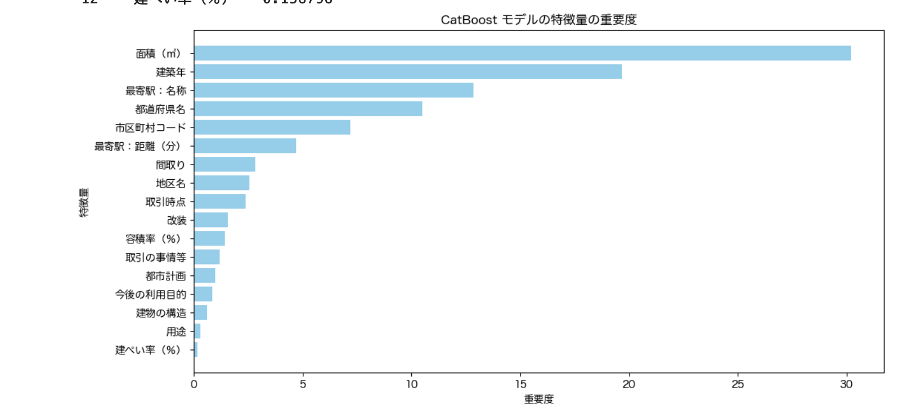
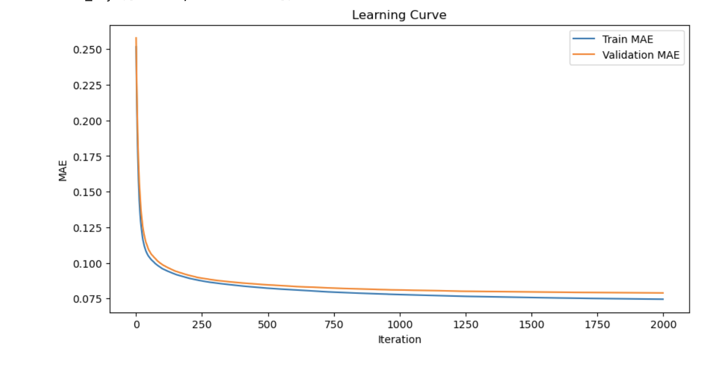

# Nishika_2024_practice  
Nishika [Training] 中古マンション価格予測

---

## 📌 プロジェクトの概要（Introduction）  
このプロジェクトは、国内の中古マンションの価格を予測することを目的としています。  
使用されるデータは、Nishikaによって土地総合情報システムから収集・加工されたものです。

- **目的変数**：取引価格（総額）の常用対数「`取引価格（総額）_log`」  
- **評価指標**：予測精度は**平均絶対誤差（MAE：Mean Absolute Error）**によって評価されます。

---

## 📊 データの概要（Dataset Description）

### 1. 学習データ（train.zip）
- **内容**：2019年以前に取引された中古マンションの価格データ  
- **使用目的**：モデルの学習

### 2. テストデータ（test.csv）
- **内容**：2020年第一四半期および第二四半期に取引された中古マンションのデータ  
- **使用目的**：価格予測モデルの評価および提出用データの生成

---

## 使用したライブラリ
glob
- ディレクトリ内のファイル名を取得するために使用。複数のCSVファイルを一括で読み込む際に便利。

pandas
- データの読み込み・前処理・分析に使用。
- データフレーム形式での操作を提供。

numpy
- 数値計算をサポートするライブラリ。
- 欠損値処理や配列操作に利用。

matplotlib.pyplot
- グラフや図の描画に使用。特徴量の重要度やデータの分布を可視化。

seaborn
- データの分布や相関関係の可視化をサポート。
- matplotlibの拡張ライブラリとして使用。

os
- ファイルのパス操作やディレクトリの作成に使用。

lightgbm
- 高速なブースティングモデルで、特徴量の重要度が高いアルゴリズム。
- 回帰モデルの構築と学習に使用。

catboost
- カテゴリカル変数の処理に強いブースティングモデル。
- モデルの精度向上と予測に使用。

---

## **作業工程（Workflow）**

#### 1️⃣ データの読み込みと前処理  
- **`glob`**を使って、複数のCSVファイルを読み込み、**`pandas`**でデータフレームに結合。  
- **不要な列の削除**（例：`市区町村名`などの削除）。  
- **カテゴリカル変数のエンコード**（CatBoostでは文字列に変換）。

---

#### 2️⃣ データの分割  
- **学習用と検証用**にデータを分割（例：2019年以前と2020年以降）。  
- **train**と**validation**データの作成。

---

#### 3️⃣ モデルの構築とトレーニング  
- **LightGBM**と**CatBoost**のモデルを構築し、それぞれで学習を実施。  
- **早期終了（early stopping）**や**ハイパーパラメータの調整**を使い、精度を向上。

---

#### 4️⃣ 予測とモデル評価  
- **MAE（Mean Absolute Error）**で予測の精度を評価。  
- **検証用データ**に対する予測結果を出力し、モデルの性能を確認。

---

### **モデルが重視する特徴量の説明（Feature Importance）**

#### **[LightGBM] モデルの精度**
- **MAE（Mean Absolute Error）**: `0.0803`  
  この結果は、モデルが高い精度で価格を予測できていることを示しています。

---

#### **特徴量の重要度（Feature Importance）**

以下は、LightGBMモデルが最も重視した**上位5つの特徴量**です：

| 特徴量           | 重要度（Feature Importance） |
|------------------|-----------------------------|
| 建築年            | 139,944.94                  |
| 面積（㎡）         | 73,863.11                   |
| 都道府県名         | 58,091.66                   |
| 最寄駅：名称       | 39,843.35                   |
| 地区名            | 19,503.95                   |

---

#### **特徴量の重要度の可視化**

以下のグラフは、LightGBMモデルが重視した特徴量を**重要度の高い順に視覚化**したものです：

---

### **解説**

- **建築年**：価格の推定において、物件の築年数は最も重要な特徴量となりました。築年数が新しい物件ほど、高い価格が予測される傾向が見られました。
- **面積（㎡）**：物件の広さも価格に大きく影響します。広い物件は高価格帯である可能性が高いため、モデルにとって重要です。
- **都道府県名**：地域ごとの不動産市場の違いも価格に反映されています。地域によって同じ間取りや広さでも価格に違いが生じます。
- **最寄駅：名称**：駅に近い物件ほど価格が高い傾向があり、最寄駅も重要な特徴量となりました。
- **地区名**：細かな地域ごとの違いもモデルに影響を与えます。

---

## **CatBoost モデルの精度と特徴量の重要度**

---

### [CatBoost] モデルの精度**
- **MAE（Mean Absolute Error）**: `0.07895958437579434`  
  → この結果は、**CatBoostモデルがLightGBMモデルよりも高い精度**で価格を予測できていることを示しています。

---

### 特徴量の重要度（Feature Importance）**

以下は、CatBoostモデルが最も重視した**上位5つの特徴量**です：

| **特徴量**         | **重要度（Feature Importance）** |
|--------------------|---------------------------------|
| 面積（㎡）         | 30.207216                      |
| 建築年             | 19.689864                      |
| 最寄駅：名称       | 12.856488                      |
| 都道府県名         | 10.503524                      |
| 市区町村コード     | 7.203636                       |

---

### 特徴量の重要度の可視化**

以下のグラフは、**CatBoostモデルが重視した特徴量の重要度**を、重要度の高い順に視覚化したものです：  

---

### 学習曲線の可視化（Learning Curve）**

以下は、**学習の進捗と精度の向上**を示す学習曲線（Learning Curve）です：  

- **グラフの解説**：  
  - 学習曲線は、**トレーニングセットと検証セット**での誤差の変動を示しています。
  - 早期終了（Early Stopping）によって、最適なタイミングで学習を停止しました。

---

### まとめ**
- **面積（㎡）と建築年**は、マンションの取引価格において**最も重要な特徴量**です。
- これらの要因が、予測モデルにとって大きな影響を与えました。

---

### 改善点や次のステップ**
- **スタッキングモデル**などの手法を導入し、より精度の高いモデルを作成します。
- 他のアルゴリズムとの比較やハイパーパラメータのさらなる調整も検討します。

---

### 著者情報（Author）**
- **名前**：  
- **メール**：your.email@example.com  
- **GitHub**：[your-github-profile](https://github.com/your-github-profile)

---

